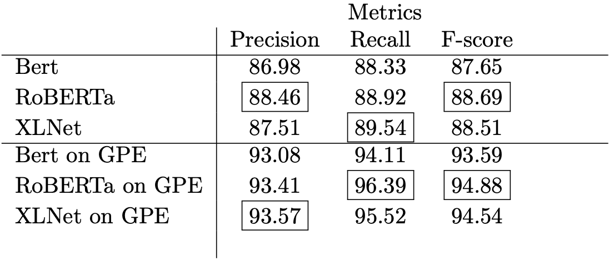

# Named Entity Recognition with Transformer-based models using SpaCy

The models trained in this project are: 
1. RoBERTa
2. XLNet  
3. BERT

These models have been fine-tuned on OntoNotes v5, converted in Spacy format for the training.

The models have been uploaded to Hugging Face:

1. [RoBERTa fine-tuned](https://huggingface.co/nicoladisabato/en_roberta_fine_tuned_ner)
2. [BERT fine-tuned](https://huggingface.co/nicoladisabato/en_bert_fine_tuned_ner)
3. [XLNet fine-tuned](https://huggingface.co/nicoladisabato/en_xlnet_fine_tuned_ner)


In the config_files_NER there are all the config files used for the model training.

Corpus folder contains the train, dev and test set in SpaCy format, ready to use.


## OntoNotes v5 Dataset
To perform the fine-tuning process of the models, the OntoNotes v5 dataset was used, which contains a large amount of text of various kinds (news, texts of telephone conversations, weblogs, news groups on usenet, broadcasts, talk shows) in three different languages, with structural and semantic information. In this study, only the corpus containing texts in English was taken into consideration, as well as most of the texts present. The reason for choosing this dataset is its usefulness for benchmarking and is often mentioned in scientific documentation in the research field.
In order to make it compatible with the NER models, the OntoNotes 5.0 dataset has been converted to the version formatted in CoNLL-2003 and with BIO tag scheme. The CoNLL-2003 format, short for ‘Conference on Natural Language Learning’, is a standard annotation format used in the train set to train NER models. You can annotate any textual data in CONLL and then train a custom NER model for a specific task. In image 1 it is possible to observe an example of CONLL-2003 format.
Through the following script we proceeded to produce the train-dev-test set splits and add the BIO tagging scheme, necessary for learning NER models. However, in order to produce a dataset compatible with the selected models using SpaCy (which is described in the following paragraph), a part of the script's source code has been modified. The sets were then created:
- onto.train.ner
- onto.development.ner
- onto.test.ner

## Fine-tuning of Transformer models for NER
After formatting and preparing the dataset it is possible to proceed to the fine-tuning of the pre-trained models. Specifically, to extract the locations from the texts contained in the Telegram Dataset, the training of the Bert, RoBERTa and XLNet models was performed.
These models have been trained through the SpaCy library, which allows you to run pre-trained pipelines, which allow you to use state-of-the-art models for tagging, parsing, NER, text classification, multi-task learning with pre-trained transformers like BERT .
SpaCy v3 then introduced transformer-based pipelines that lead it to achieve an accuracy comparable to state-of-the-art approaches.
The data format used in SpaCy v3 is a binary format created by serializing a DocBin, which represents a collection of Doc objects. Specifically this represents the same format that Spacy generates as output: annotated Doc objects. Furthermore, this format is extremely efficient in storage, especially in packing many documents at the same time.
Then convert the sets of train, dev, and test to ̄.spacy formats with the following command:


````
```
# Converts train CoNLL-03 to SpaCy format
!python -m spacy convert -c ner -b en_core_web_sm -n 10 /content/drive/MyDrive/OntoNotes -5.0-NER-BIO-master/onto.train.ner ./corpus

# Converts validation set
!python -m spacy convert -c iob -s -n 10 -b en_core_web_sm /content/drive/MyDrive/OntoNotes -5.0-NER-BIO-master/onto.development.ner ./corpus

# Converts test set
!python -m spacy convert -c iob -s -n 10 -b en_core_web_sm /content/drive/MyDrive/OntoNotes -5.0-NER-BIO-master/onto.test.ner ./corpus
```
````

Also, to train a pipeline using Spacy you need a configuration file ̄config.cfg which includes all the model specifications and hyperparameters. By customizing this file it is therefore possible to run different architectures and models.

# Quantitative analysis

The different trained models were compared quantitatively by evaluating both their performance based on the model's general precision, recall and f-score metrics and the scores relating to the specific GPE entity of the Named Entity Extraction task. The following table shows the final results.


